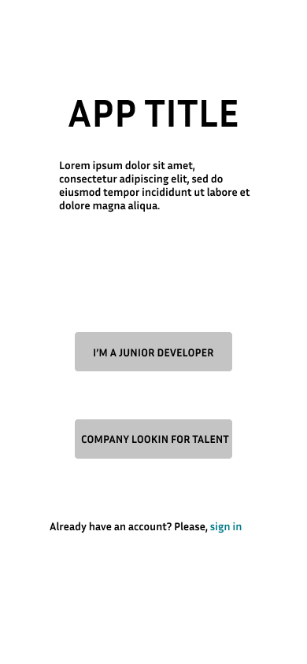
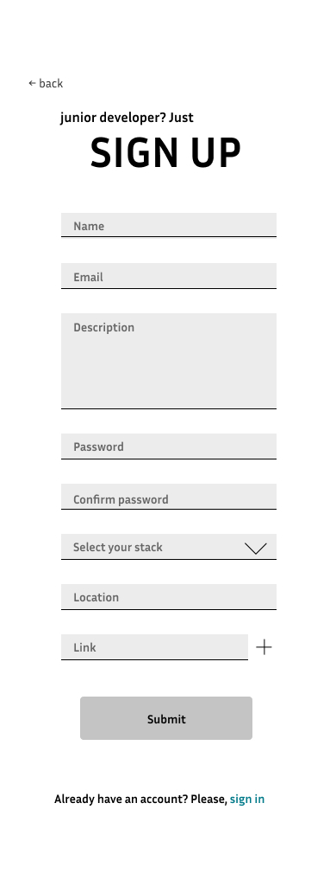
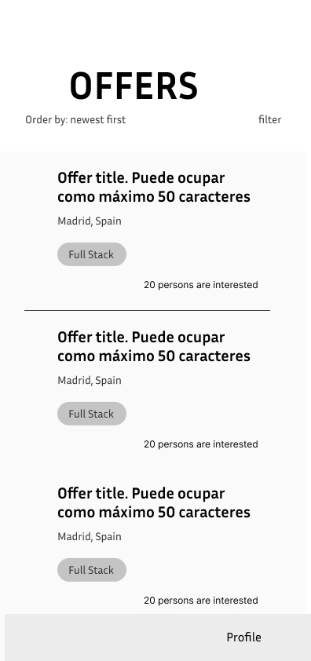
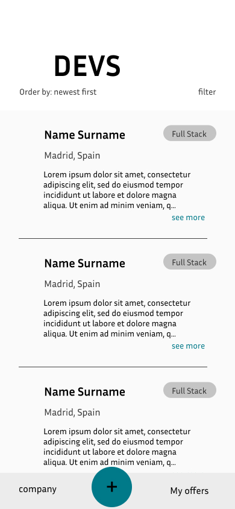
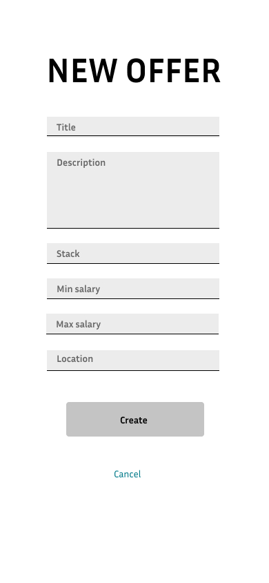
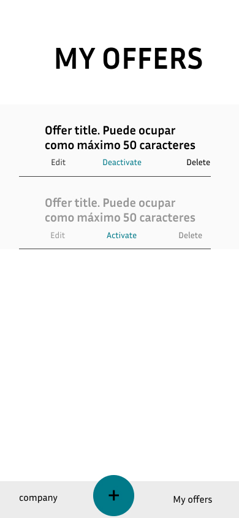
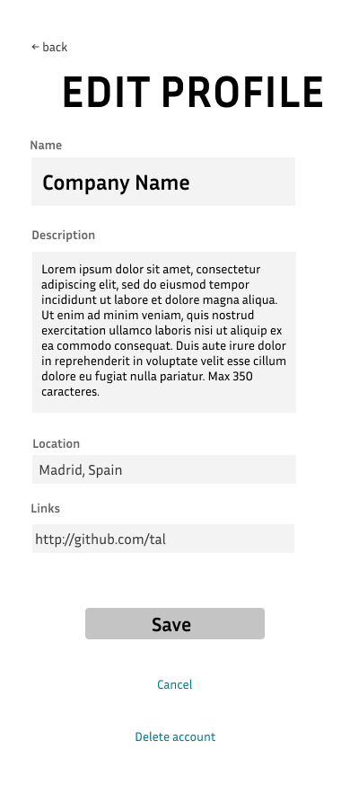
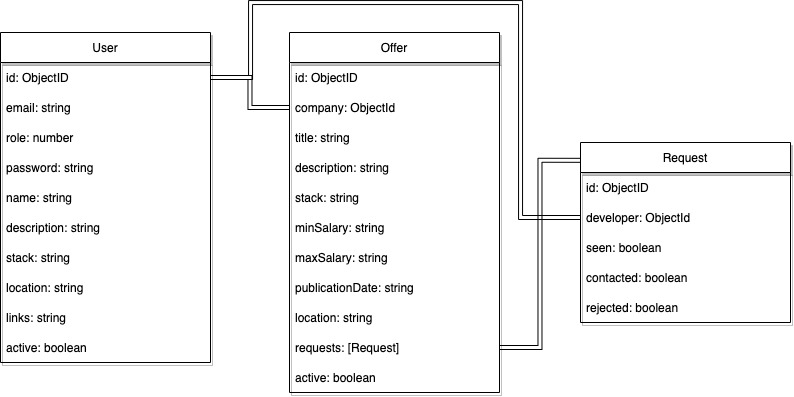

#  TINDEV

## INTRO
   
   Tindev is a simple app that connects low experienced developers with companies. No matter age, phisical appearance, gender... all people are valid no matter what, the only thing that matters is the desire to move on.

## FUNCTIONAL DESCRIPTION

Every user that lands on this app, can navigate between the legal advice, about page and a contact form, that sends a message to the admin e-mail.

After registering, depending on your role, you can:
####  Developer (role 1):
- Update name, description, stack, link and location.
- Deactivate profile
- See all public offers
- See an offer in detail
- Apply to a specific offer
- See a company profile
- See other offers from a specific company

#### Company (role 2):
- Update name, description, link and location.
- Deactivate profile
- Create an offer
- Deactivate/activate and offer
- Edit title, description, stack, salary and location
- Delete offer (irreversible)
- See candidates that applied to an offer
- See specific candidate profile
- Contact candidate from an offer request
- Reject candidate
- See all developers
- Contact candidate from developer profile

### Use cases

### Wireframes
the first sketches of the application's interface

##### General

##### Developer

##### Company

---

## TECHNICAL DESCRIPTION

### Blocks

#### Techonologies used

> ## React  

> ## Node 

> ## Express 

> ## JWT 

> ## NodeMailer 

> ## Mongoose 

> ## Mongo 

### Data model

    user {
        id: ObjectID,
        role: number (required),
        email: string (required), 
        password: string (required),
        name: string (required),
        description: string (required),
        stack: string,
        location: string,
        links: string,
        active: boolean (required),
    }

    offer {
        id: ObjectID,
        company: Objetc ID (required),
        title: string (required),
        description: string (required),
        stack: string (required),
        minSalary: number (required),
        maxSalary: number (required),
        publicationDate: string (required),
        location:  string (required),
        requests:[Request]
        active: boolean (required),
    }

    request {
        id: ObjectID,
        developer: ObjectID (required),
        seen: boolean (required),
        contacted: boolean (required),
        rejected: boolean (required),
    }

---

## TO-DO LIST
- Update user email and password
- Checkbox for remote job option
- Filter developers and offers
- Test server side logics
