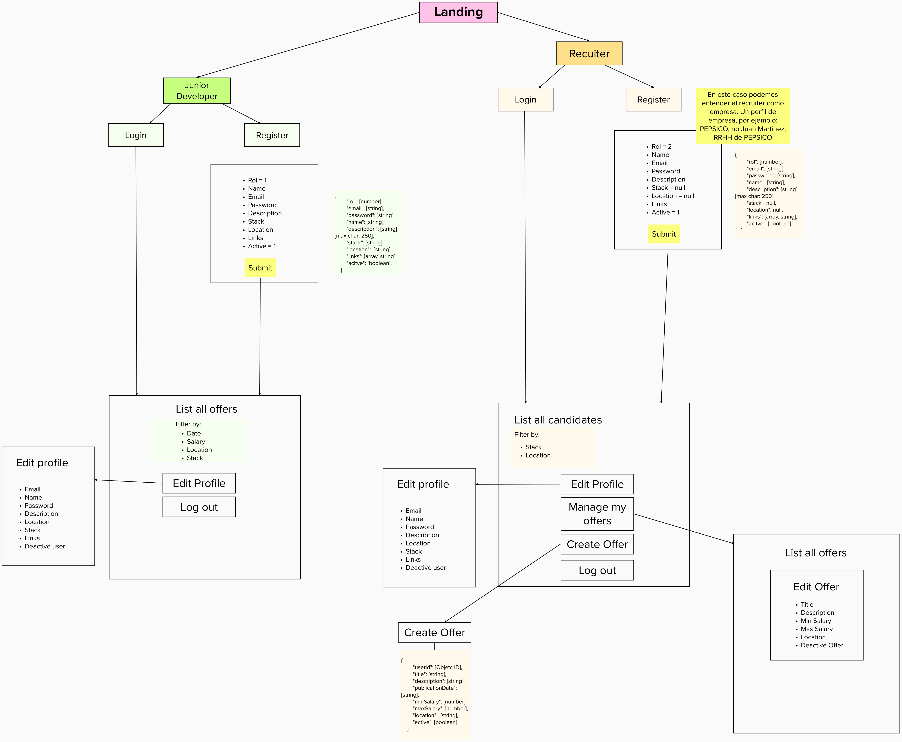

# Junior Devs Jobs

## Introduction
    Una aplicación en la que tanto recruiters como devs junior puedan mostrar sus ofertas. 
    Desde el lado del recruiter: publicar ofertas y encontrar candidatos.
    Desde el lado del dev: ver/recibir ofertas.
    Los desarrolladores podrán tener un perfil con únicamente datos relevantes a la hora de la contratación: breve descripción de quien eres, qué tecnologías conoces (no edad, no género, no foto) y link interesantes (Github, Codepen, Linkedin...); que será lo que podrán ver los recruiters.

## Functional Description
En esta aplicación tenemos dos líneas funcionales distintas en base al rol del usuario:

###  **Rol 1 - usuario demandante (junior dev) **

    El rol 1 se refiere al desarrollador junior que quiere ver ofertas de trabajo.

    En este caso, puede acceder a **todas las ofertas** , las cuales podría filtrar por fecha, localización, rango salarial o stack que se busca.

    El contacto con la empresa por la oferta se hará mediante un botón que envía un correo a la dirección proporcionada por esta.

###  **Rol 2 - usuario ofertante (recruiter/empresa) **

    El rol 2 se refiere al recruiter que crea una oferta de trabajo.

    En este caso, pueden ver los perfiles de los usuarios (datos que introduce el usuario al crear la cuenta) que pueden filtrar por stack al que quieren acceder y localización. Igualmente, al crear una oferta, aparecen posibles candidatos que coinciden en stack.

    El contacto con el usuario se hará mediante un botón que envía un correo a la direccion proporcionada por este.

### Use Cases
En base a los casos de uso que se han descrito en el punto anterior, listo las funciones que se utilizarán para realizar las acciones.
- **registerUser**: registra a los usuarios desarrolladores. Por defecto tiene el rol seteado

- **registerCompany**: registra a los usuarios recruiter o empresa. Por defecto tiene el rol seteado, igual que las propiedades 'null' que no utiliza del modelo de datos.

- **authenticateUser**

- **updateUser**: actualiza los datos de usuario

- **updateCompany**: actualiza los datos de la compañia

- **retrieveUser**: devuelve el usuario indicado, con rol de developer 

- **retrieveCompany**: devuelve el usuario indicado, con rol de compañía

- **retrieveAllUsers**: devuelve todos los usuarios activos con rol de desarollador

- **deleteUser**: nunca se eliminarán usuarios de la base de datos, sólo se desactivará el usuario.

**deleteCompany**: nunca se eliminarán usuarios de la base de datos, sólo se desactivará el usuario.

- **createOffer**

- **updateOffer**

- **retrieveAllOffers**: devuelve todas las ofertas activas

- **retrieveUserOffers**: devuelve las ofertas activas de un usuario concreto

- **retrieveOffer**: devuelve una oferta concreta

### Activities

### Wireframes / UI Design

## Technical Description

### Blocks

### Data Model (ER)

Encontramos dos esquemas distintos: 'user' y 'offer'. El 'user' se utilizará tanto para los usuarios demandantes como para los ofertantes/empresas, diferenciandolos mediante una propiedad 'rol'.

A continuación, el detalle de los esquemas:

    user {
        id: ObjectID,
        rol: number,
        email: string,
        password: string,
        name: string,
        description: string (max char: 250),
        stack: string,
        location: string,
        links: [string],
        acitve: boolean,
    }

    offer {
        id: ObjectID,
        userId: Objetc ID,
        title: string,
        description: string,
        publicationDate: string,
        minSalary: number,
        maxSalary: number,
        location:  string,
        active: boolean,
    }

### Code Coverage

### Technologies

- React 
- Node 
- Express 
- JWT 
- Mongoose 
- Mongo 

### TODO list

- Offer contact counter